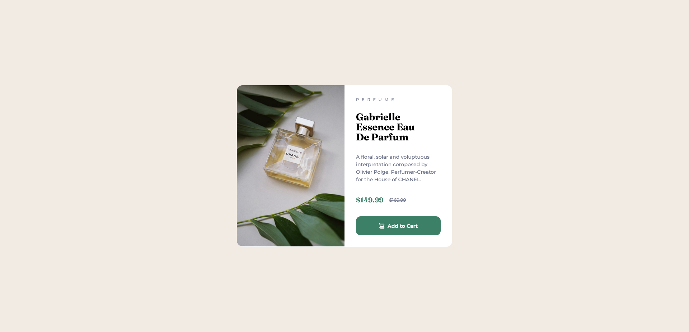

# Frontend Mentor - Product preview card component solution

Ceci est ma solution au [défi de composant de carte de prévisualisation de produit sur Frontend Mentor](https://www.frontendmentor.io/challenges/product-preview-card-component-GO7UmttRfa). Ce projet m'a permis d'améliorer mes compétences en développement en travaillant sur un projet réaliste.

## Table des matières

- [Aperçu](#aperçu)
  - [Le défi](#le-défi)
  - [Screenshot](#screenshot)
  - [Liens](#liens)
- [Mon processus](#mon-processus)
  - [Construit avec](#construit-avec)
  - [Ce que j'ai appris](#ce-que-jai-appris)
- [Auteur](#auteur)
- [Remerciements](#remerciements)

## Aperçu

### Le défi

Les utilisateurs doivent pouvoir :

Voir la mise en page optimale en fonction de la taille de l'écran de leur appareil.
Voir les états de survol et de focus des éléments interactifs.

### Screenshot



### Liens

- Solution URL: [Repository](https://github.com/laurentGurbala/Product-preview-card-component)
- Live Site URL: [Site live](https://laurentgurbala.github.io/Product-preview-card-component/)

## Mon processus

### Construit avec

- Balises HTML5 sémantiques
- Propriétés personnalisées CSS
- Flexbox

### Ce que j'ai appris

Lors de ce projet, j'ai appris à intégrer des images responsives et à gérer les états interactifs des boutons, notamment avec des icônes SVG dans les boutons.

```html
<picture class="card__image">
  <source media="(min-width: 768px)" srcset="./images/image-product-desktop.jpg">
  
</picture>
```

## Auteur

- Website [laurent gurbala](https://github.com/laurentGurbala)
- Frontend Mentor [@laurent gurbala](https://www.frontendmentor.io/profile/laurentGurbala)
- X [@laurent gurbala](https://x.com/GurbalaLaurent)

## Remerciements

Un grand merci à la communauté Frontend Mentor pour ses conseils et ses retours constructifs.
